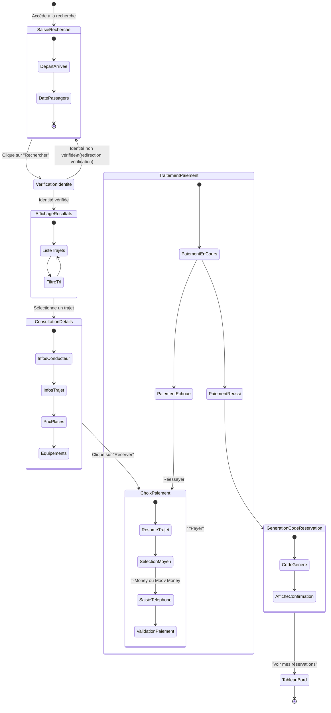
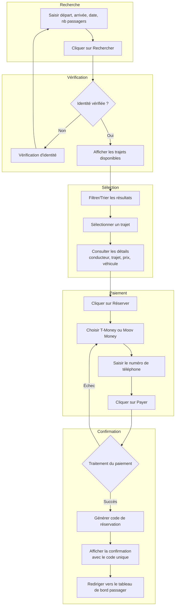

```mermaid
stateDiagram-v2
    [*] --> SaisieRecherche : Accède à la recherche

    state SaisieRecherche {
        [*] --> DepartArrivee
        DepartArrivee --> DatePassagers
        DatePassagers --> [*]
    }

    SaisieRecherche --> VerificationIdentite : Clique sur "Rechercher"

    state VerificationIdentite <<choice>>
    VerificationIdentite --> SaisieRecherche : Identité non vérifiée\n(redirection vérification)
    VerificationIdentite --> AffichageResultats : Identité vérifiée

    state AffichageResultats {
        [*] --> ListeTrajets
        ListeTrajets --> FiltreTri
        FiltreTri --> ListeTrajets
    }

    AffichageResultats --> ConsultationDetails : Sélectionne un trajet

    state ConsultationDetails {
        [*] --> InfosConducteur
        InfosConducteur --> InfosTrajet
        InfosTrajet --> PrixPlaces
        PrixPlaces --> Equipements
    }

    ConsultationDetails --> ChoixPaiement : Clique sur "Réserver"

    state ChoixPaiement {
        [*] --> ResumeTrajet
        ResumeTrajet --> SelectionMoyen
        SelectionMoyen --> SaisieTelephone : T-Money ou Moov Money
        SaisieTelephone --> ValidationPaiement
    }

    ChoixPaiement --> TraitementPaiement : Clique sur "Payer"

    state TraitementPaiement {
        [*] --> PaiementEnCours
        PaiementEnCours --> PaiementReussi
        PaiementEnCours --> PaiementEchoue
        PaiementEchoue --> ChoixPaiement : Réessayer
    }

    PaiementReussi --> GenerationCodeReservation

    state GenerationCodeReservation {
        [*] --> CodeGenere
        CodeGenere --> AfficheConfirmation
    }

    GenerationCodeReservation --> TableauBord : "Voir mes réservations"

    TableauBord --> [*]
```

```mermaid
flowchart TB
    subgraph Recherche
        A[Saisir départ, arrivée, date, nb passagers] --> B[Cliquer sur Rechercher]
    end

    subgraph Vérification
        B --> C{Identité vérifiée ?}
        C -->|Non| D[Vérification d'identité]
        D --> A
        C -->|Oui| E[Afficher les trajets disponibles]
    end

    subgraph Sélection
        E --> F[Filtrer/Trier les résultats]
        F --> G[Sélectionner un trajet]
        G --> H[Consulter les détails\nconducteur, trajet, prix, véhicule]
    end

    subgraph Paiement
        H --> I[Cliquer sur Réserver]
        I --> J[Choisir T-Money ou Moov Money]
        J --> K[Saisir le numéro de téléphone]
        K --> L[Cliquer sur Payer]
    end

    subgraph Confirmation
        L --> M{Traitement du paiement}
        M -->|Échec| J
        M -->|Succès| N[Générer code de réservation]
        N --> O[Afficher la confirmation\navec le code unique]
        O --> P[Rediriger vers le tableau de bord passager]
    end
```
